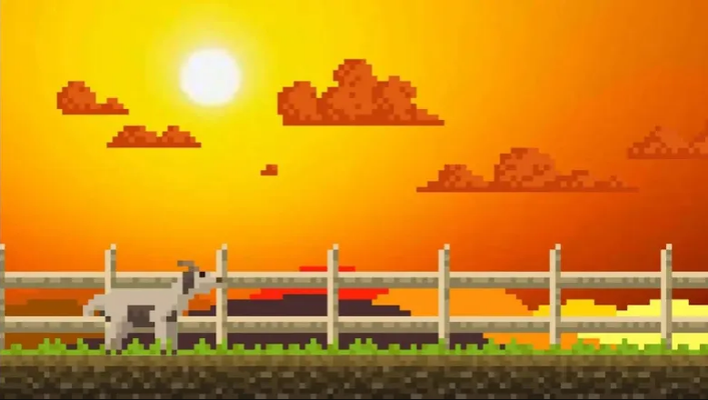

Goat Game
===
A 2D infinite runner game where you control a goat who escaped from its farmer. 
---
This game was built with the [Unity Game Engine]. It is an unfinished project from highschool. Some files have been lost; a screenshot of the lost version of the game is below.

### Install (Windows)
* [Install Git Bash](https://git-scm.com/download/win) for GitHub commits.
* [Install Visual Studio Code](https://code.visualstudio.com/download) for code editing.
* [Install Unity Hub](https://unity.com/download).
* [Clone this repository](https://docs.github.com/en/repositories/creating-and-managing-repositories/cloning-a-repository#cloning-a-repository) to a directory on your computer. That directory will be referred to as `root`.
* Add the `root` directory to Unity Hub Projects list. In Unity Hub, go to Projects, click Add, navigate to the `root` directory, and click Open.
* A warning may appear that says Missing Editor Version. If so, install the missing version.

Now you should be able to open and edit the game using Unity.

### Contribute
Unfortunately, this project doesn't support community contributions right now. Feel free to fork, but be sure to [read the license](https://github.com/mboyea/www-mboyea-com/blob/main/LICENSE.md).

[Unity Game Engine]: https://unity.com/
